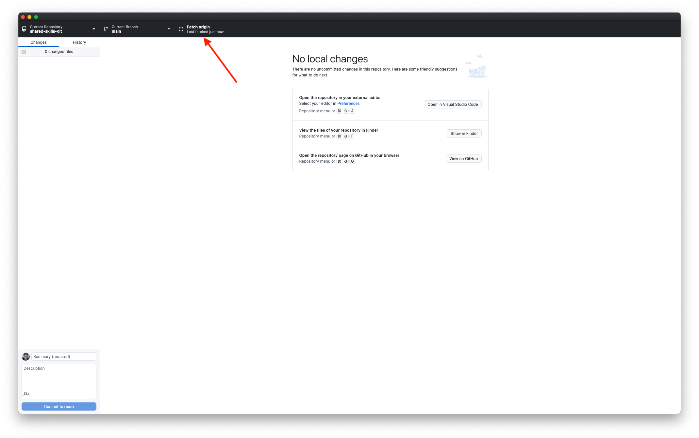
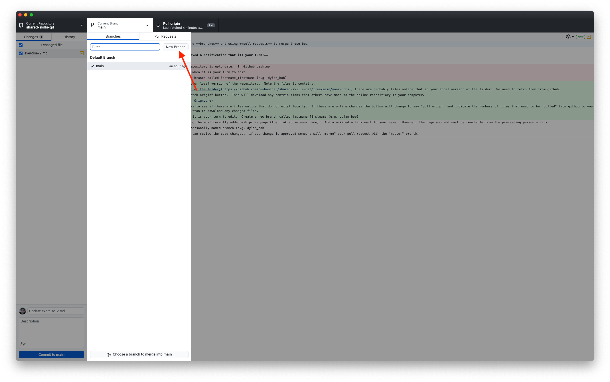
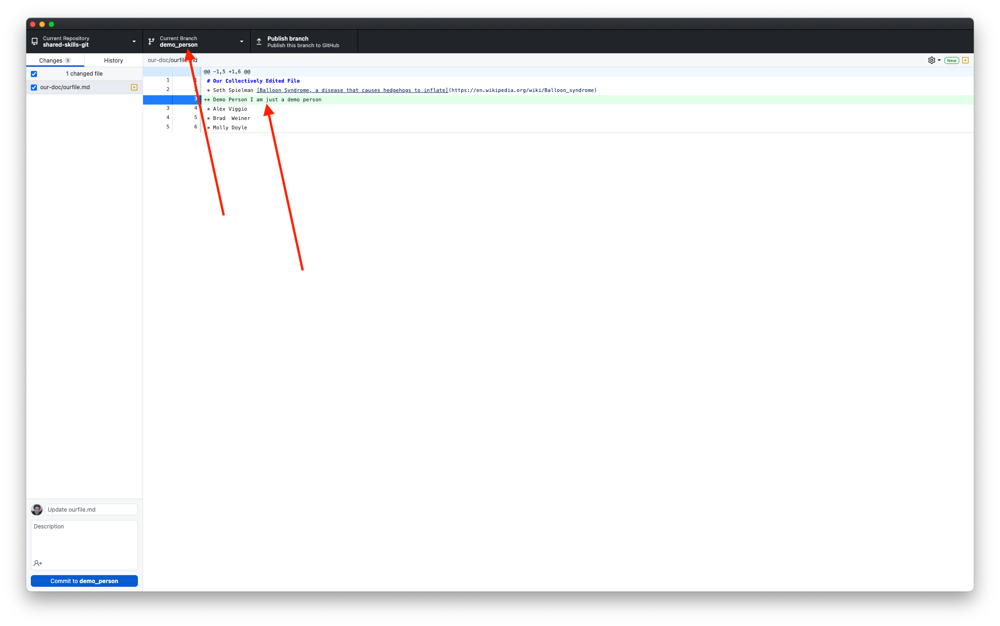

# Exercise 2
At this point we have all contributed to the repository however to different files.  In part two of this exercise we will collectively edit a single document.

This part of the exercise demonstrates the utility of Github for collectively editing files but its also shows how one can formalize workflows using the tool.  

You will be greating **branches** and using **pull requests** to merge those beanches back into the main branch. 

**Do not begin until you have recieved a notification that its your turn!**

1. Open the "your-docs" folder in your local version of the repository.  Note the files it contains.
2.  Navigate to [the online version of the folder](https://github.com/cu-boulder/shared-skills-git/tree/main/your-docs), there are probably files online that in your local version of the filder.  We need to fetch them from github.
3.  In Github desktop click the "fetch origin" button.  This will download any contributions that others have made to the online repositiory to your computer.  

4.  The "Fetch Origin" button checks to see if there are files online that do not exist locally.  If there are online changes the button will change to say "pull origin" and indicate the numbers of files that need to be "pulled" from github to your local computer.  Click the pull button to download any changed files. 
4. Once you recieve a notification it is your turn to edit.  Create a new branch called lastname_firstname (e.g. dylan_bob).  
3. Edit `ourfile.md` file by visting the most recently added wikipedia page (the link above your name).  From that page browse link until you find an intersting page.  Once you have found somethign worth sharing add the url (wikipedia link) next to your name.  The page you add must be reachable from the preceeding person's link.  
4. First commit your changes, **then** hit the publish branch button.
5. Create a pull request so others can review the code changes.  if you change is approved someone will "merge" your pull request with the "master" branch.
7. Delete your branch
8. Contact the next person on the list by creating an issue
