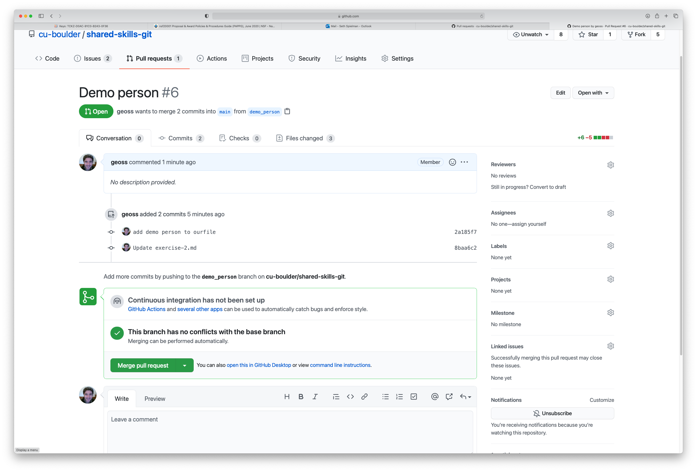
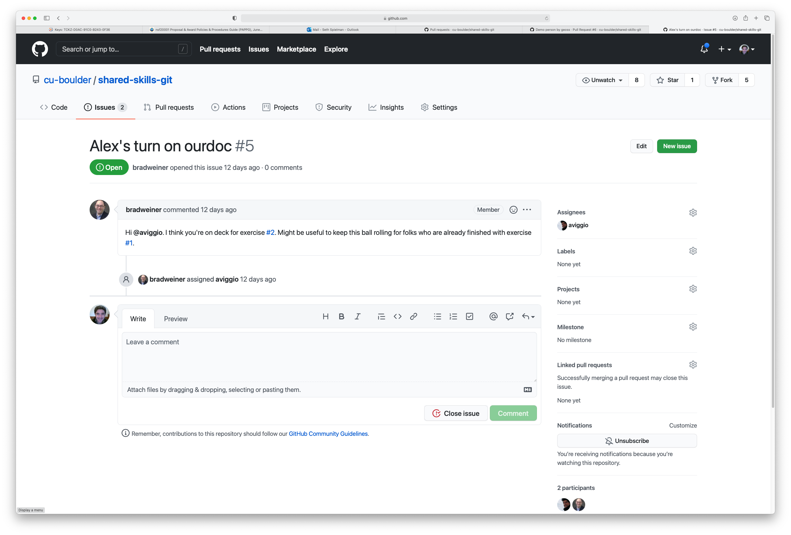
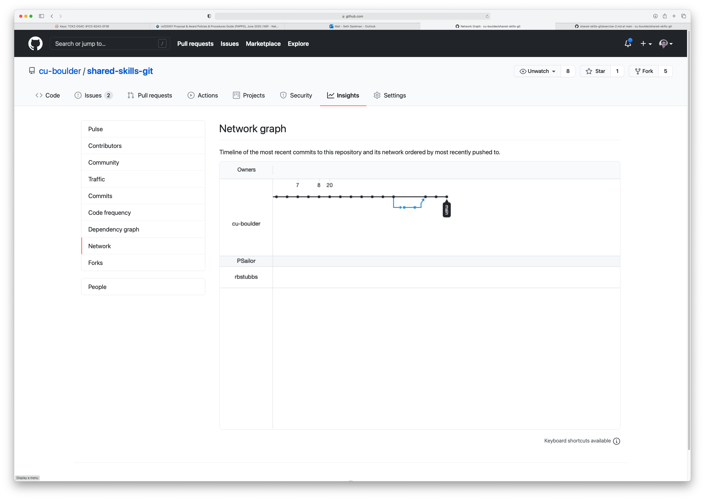

# Exercise 2
At this point we have all contributed to the repository however to different files.  In part two of this exercise we will collectively edit a single document.

This part of the exercise demonstrates the utility of Github for collectively editing files but its also shows how one can formalize workflows using the tool.  

You will be greating **branches** and using **pull requests** to merge those beanches back into the main branch. 

**DO NOT BEGIN THIS EXERCISE UNTIL YOU HAVE RECIEVED A NOTIFACTION THAT IT'S YOUR TURN**

1. Make sure your version of the repository is upto date (using either the desktop app or the command line).
2. You will recieve a notification when it is your turn to edit.
3. Once its your turn, create a new branch called lastname_firstname (e.g. dylan_bob)
3. Edit `ourfile.md` file by visting the most recently added wikiprdia page (the link above your name).  Add a wikipedia link next to your name.  However, the page you add must be reachable from the preceeding person's link.  
4. Commit and push the changes to personally named branch (e.g. dylan_bob)
5. Create a pull request so others can review the code changes.  if you change is approved someone will "merge" your pull request with the "master" branch.
7. Delete your branch
8. Contact the next person on the list by creating an issue

1. Open the "your-docs" folder in your local version of the repository.  Note the files it contains.
2.  Navigate to [the online version of the folder](https://github.com/cu-boulder/shared-skills-git/tree/main/your-docs), there are probably files online that in your local version of the filder.  We need to fetch them from github.
3.  In Github desktop click the "fetch origin" button.  This will download any contributions that others have made to the online repositiory to your computer.  

4.  The "Fetch Origin" button checks to see if there are files online that do not exist locally.  If there are online changes the button will change to say "pull origin" and indicate the numbers of files that need to be "pulled" from github to your local computer.  Click the pull button to download any changed files. 
4. Once you recieve a notification it is your turn to edit.  Create a new branch called lastname_firstname (e.g. dylan_bob).  
3. Edit `ourfile.md` file by visting the most recently added wikipedia page (the link above your name).  From that page browse link until you find an intersting page.  Once you have found somethign worth sharing add the url (wikipedia link) next to your name.  The page you add must be reachable from the preceeding person's link.  
4. First commit your changes, **then** hit the publish branch button.
5. GIthub desktop will prompt you to create a pull request.  When you click the button you will be sent to the github website where you create your pull requesr (PR).  When you make a pull request you are asking to merge your branch into the main branch.  A person has to affirmatively accept your changes and "merge" your branch with the "main" branch.  They will also delete your branch. 
8. Contact the next person on the list by creating an issue and atting them with @githubusername.  Once your've been notified its your turn to edit ourfile. 
9. The [network graph](https://github.com/cu-boulder/shared-skills-git/network) allows you to visualize the branches and merges. 
